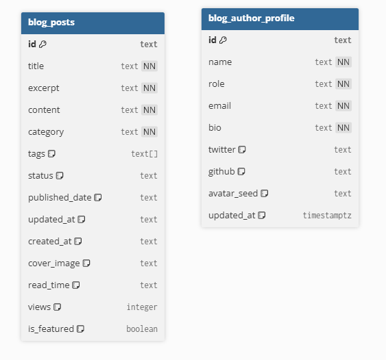

# journal-on
A personal blog built to keep track of interesting things I do, learn and whatever just comes to mind.

## Tech Stack
- Frontend:
    - React
    - Tailwind
- Backend:
    - FastAPI
    - Starletter (ASGI server)
    - Supabase (db)

## Features
- Public blog:
    - Main page
    - Single post
    - Tag pages
    - Category pages
- Private author / admin area:
    - Login
    - Dashboard
    - Editor
    - Settings / profile

## API
- Public API
    - GET /api/posts
    - GET /api/posts/featured
    - GET /api/posts/{post_id}
    - GET /api/tags
    - GET /api/tags/{tag}/posts
    - GET /api/categories
    - GET /api/categories/{category}/posts
    - GET /api/author
- Author API
    - POST /api/admin/login
    - POST /api/admin/logout
    - GET /api/admin/me
    - GET    /api/admin/dashboard
    - GET    /api/admin/posts
    - GET    /api/admin/posts/{id}
    - POST   /api/admin/posts
    - PATCH  /api/admin/posts/{id}
    - DELETE /api/admin/posts/{id}
    - POST   /api/admin/posts/{id}/publish
    - POST   /api/admin/posts/{id}/unpublish
    - GET    /api/admin/profile
    - PATCH  /api/admin/profile

## Data Model
